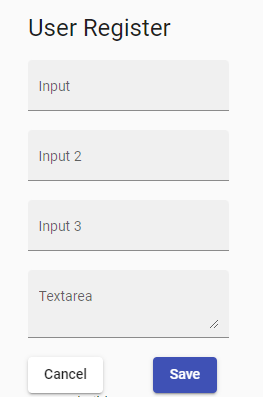
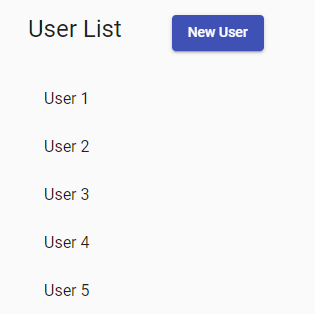

# Refera - FrontEnd Junior Code Challenge

## Description

Welcome to Refera's Junior FrontEnd Code Challenge!
The objective of the challenge is to build a web application where we can visualize the data of registered users, following the **Acceptance criteria**.
For this challenge, you can consume data from an API, which is at this link: https://jsonplaceholder.typicode.com/users

If you don't want to use the API, you can create a fixed Array with user data that will be listed.

Create a web page, **responsive**, that can list the data of registered users, to list users, it will be necessary to consume the API mentioned above, or use fixed array with user data.
Also create a "New User" button, which will open a form to register the new user.
PS: It is not necessary to save data, or user data consistencies, just create the user registration form.

Create a simple form, paying attention to the size of each field as needed. The fields that will compose the form are: 
- Full Name 
- CPF
- User Age 
- and Address

The Address field is not necessary to specify, city name, states or something like that, just allocate this information in a single Address field.
Still on the form, create 2 buttons, "Cancel", and "Save". By clicking "Cancel", the form will close, and return to the user list.
When clicking on "Save", the form should display a modal "Save successfully!", remember, it is not necessary to save the data, just display the dialog message.

We use React in the FrontEnd of our real application, but feel comfortable choosing an appropriate technology that you are familiar with. We recommend using frameworks like Angular, or React, or any similar ones. For the creation of the screen components, feel comfortable to use Bootstrap, Angular Material, Material Design, or any other similar component library.

## Resources

Use the images below as an example, but try something more like a real application.

## Acceptance criteria

- Provides clear instructions on how to run the app in development mode
- A webpage, following the low-fidelity prototype presented in **Resources**
  - Table with data of "registered" users
  - Button to open the user registration form
- User registration form
  - Form with the user information fields mentioned above
  - "Save" button to display the "Save successfully" dialog message.
  - "Cancel" button to return to user list

## Challenge guidelines

- The usage of git will be taken into consideration on the evaluation
- For this challenge, **Create** a repository in your Github account
- You can create a private repository in your account if you want
- If your repository is private, share your repository with email: suporte@refera.com.br
- Send a email with the link of your repository to: suporte@refera.com.br
- Remenber, all the written information requested on **Acceptance criteria** should be added on a README.md file inside the your repository
